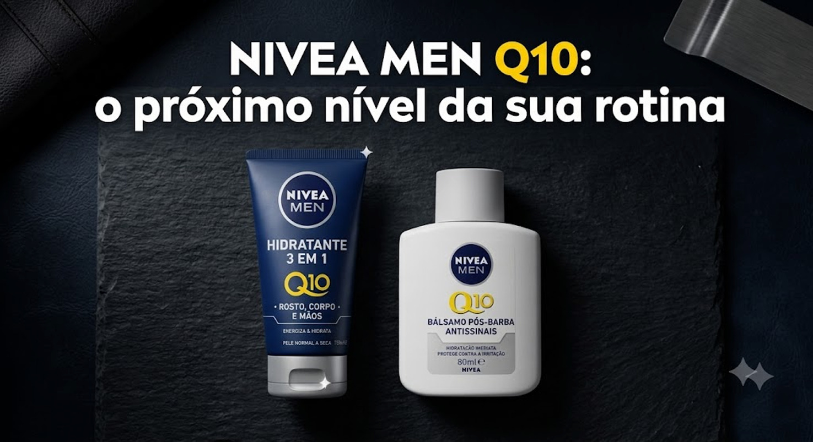
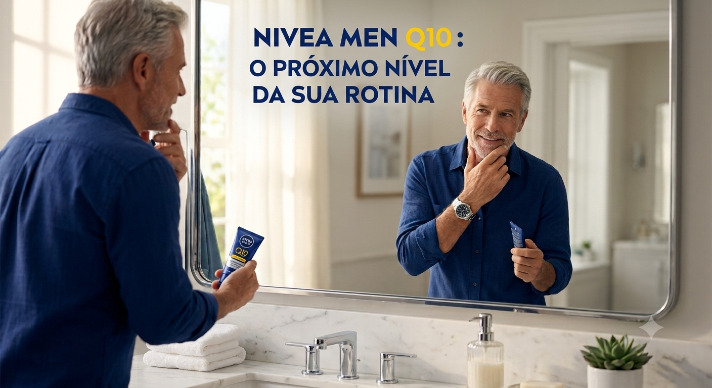
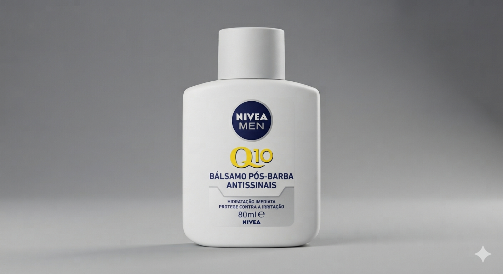
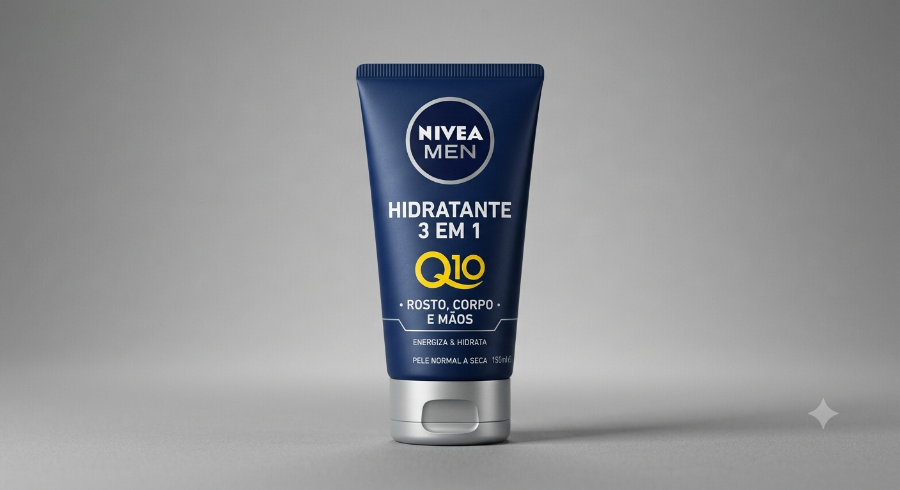
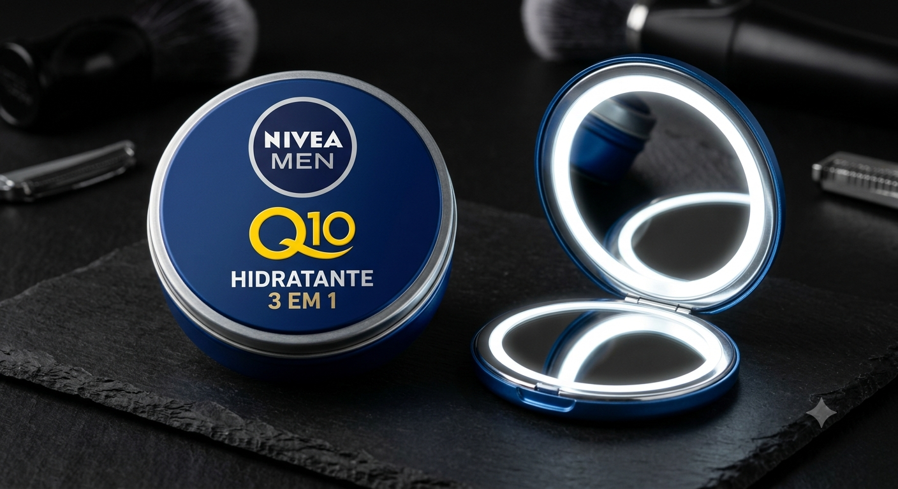

    
       
    

        Universidade de São Paulo 
        Escola de Comunicações e Artes  
        Departamento de Relações Públicas, Propaganda e Turismo
    

      
    

        Giovana Mariani Paganotti   
        Julia Miranda de Almeida 
        Lara Gonçalves de Souza Leão 
        Paula Araújo Gomes Lambert 
        Sophia Rodrigues de Lana 
        Victoria Ábia dos Santos Lourinho
    

      
    
<b>Análise de marca no ponto de venda:</b> NIVEA

                 
    <footer>
        
São Paulo   2026
        
 
    </footer>

> **Atenção:** Este é um protótipo acadêmico em formato de site, criado para simular uma campanha da Nivea direcionada ao público-alvo masculino e sênior[cite: 8]. Possui objetivo estritamente acadêmico[cite: 8]. Trata-se de um site comercial fictício e navegável, não tendo sido feito nem patrocinado pela NIVEA[cite: 8].

# **CAMPANHA PROMOCIONAL**

# **Conceito da Campanha**

Frase de Apoio: *“O conforto que sua pele precisa, com a praticidade que sua rotina pede”.*   
O conceito da campanha fundamenta-se a partir da ideia de conforto e funcionalidade, desmistificando o cuidado da pele para o público masculino 60+ ao reposicioná-lo: de um ato que antes possivelmente era visto como “vaidade estética” para “ferramenta de manutenção da saúde”. A narrativa foca na premissa de que o homem maduro valoriza também o bem-estar e que precisa de soluções diretas para cuidar e se sentir bem na própria pele, sem complicações. É sob este ponto de vista que surge o norte para a comunicação da campanha: *“O conforto que sua pele precisa, com a praticidade que sua rotina pede”.*   
Dessa forma, o conceito se afasta de promessas irreais de rejuvenescimento e adota um zona/território de acolhimento e confiança que estão diretamente incorporados no DNA da NIVEA. O autocuidado passa a ser comunicado como um ritual de prontidão, validado pela tecnologia do Q10. Ao alinhar cuidado e eficácia, a ideia central valida o homem sênior, demonstrando que adotar uma rotina de hidratação não é uma quebra de sua masculinidade, mas sim um decisão inteligente para garantir conforto, saúde e autoestima. Harmonicamente, essa abordagem abre caminho para o convite que a ação promocional faz: elevar a experiência diária de cuidados para “o próximo nível”

# **Insight da Campanha**

O Insight central da campanha nasceu do cruzamento entre a observação comportamental do consumidor no PDV (ponto de venda), a escuta ativa dos mesmos nas redes sociais e através de pesquisas, que hoje são dados de mercado. Identificou-se que o público masculino se sente como um “intruso” (especialmente gerações mais velhas, como X e Baby Boomers) ao estarem em um corredor de autocuidado que é um ambiente historicamente feminino, mesmo que sintam interesse.   
Essa percepção encontra apoio através dos seguintes indicadores de mercado: 

* Tendência do Consumo: Estudos recentes sobre autocuidado masculino no Brasil realizados pela Kantar revelam que o interesse dos homens por cuidados pessoais não é algo momentâneo, mas uma mudança em nossa estrutura de comportamento. Os dados mostram uma expansão na penetração de categorias de cuidados com a pele, impulsionada por homens que buscam a manutenção da saúde dermatológica, consolidando o skincare de base como um hábito integrado à rotina de higiene diária.  
* Estilo de Vida e Bem-Estar: Em paralelo, dados divulgados apontam que o crescimento do mercado de cuidados pessoais masculinos está diretamente relacionado à busca por qualidade de vida e de longevidade ativa. O homem contemporâneo está quebrando tabus culturais e associando o uso de produtos de cuidado pessoal à sua saúde geral, exigindo, porém, soluções práticas e que sejam eficazes sem a necessidade de seguir muitos passos.

O comentário recorrente desse shopper nas redes sociais amarra essas duas pesquisas a uma exigência inegociável: praticidade e eficácia sem complexidade. Ele rejeita rotinas de múltiplos passos. A partir dessa dor, o insight estratégico foi "masculinizar a alta tecnologia", traduzindo os benefícios biológicos da coenzima Q10 para uma linguagem de performance e utilidade. É por isso que o Hidratante 3 em 1 se torna o protagonista: ele entrega o resultado máximo com o mínimo de esforço. O insight revela que, para converter esse shopper, a marca não deve tentar ensiná-lo a ser vaidoso, mas sim oferecer uma solução direta e multifuncional que se encaixe organicamente nos hábitos que ele já domina, como o momento pós-banho e o pós-barba.

# **Público**

## O público alvo da campanha foi pensado a partir das pesquisas e análises realizadas pelas autoras para o trabalho anterior.

Os resultados obtidos evidenciaram que o público feminino entre a faixa etária compreendida entre 26 e 40 anos  tem a maior participação dentre os consumidores de beleza e de autocuidado (ICTQ, 2026). Como consequência disso, é sabido que a Nivea tem tentado expandir suas vendas de modo a fazer com que um maior contingente numérico de homens passe a enquadrar as vendas da linha facial da marca por meio do market share (UOL, 2018).   
Alinhado a isso, o grupo, analisou que uma outra parcela que, cada vez mais, assume uma posição de protagonismo nos números de vendas da Nivea é a parcela de homens idosos (Estudo Consmentology, 2025, apud Marcas e Mercados, 2025). Conforme aponta o Estudo Cosmentology 2025, realizado pela Croma Consultoria com 1.000 brasileiros, os Baby Boomers e a Geração X ampliaram o interesse por produtos e serviços voltados ao bem-estar e ao cuidado com a pele nos últimos anos, representando 6% dos consumidores de produtos para autocuidado em 2025\.  
Percebe-se, ainda, que os produtos da Nivea se destacam entre os que esse público consome devido à sua associação com cuidados básicos e hidratação (Marcas e Mercados, 2025).  
Dessa forma, as autoras perceberam uma grande oportunidade a ser aproveitada pela Nivea: além da ação aqui descrita e proposta abranger o contingente masculino, há muito visado pela marca, a ação busca alcançar, de maneira mais específica, homens que pertencem à economia prateada. Portanto, a campanha não só busca atrair um novo público de consumidores, como também tenta fazê-lo de modo a acompanhar as mudanças de mercado \- novos públicos que se atraem por questões cosméticas e de cuidados com a pele \-, aproveitando, também, o destaque já consolidado da marca entre homens mais velhos. Assim, as ações de promoção de vendas aqui descritas têm como público alvo a parcela da população composta por homens na faixa etária de 55 a 75 anos.

# **Praça: quais serão os varejos? Grandes supermercados? Farmácias? Interior? Grande São Paulo? Por quê? [paula.arauj@usp.br](mailto:paula.arauj@usp.br)**

# **Produto** 

Foram decididos dois SKUs principais para compor a ação promocional da linha NIVEA MEN Q10.   
	NIVEA MEN Q10 Hidratante 3 em 1 \- 150ml (SKU principal): o hidratante 3 em 1 foi definido como produto principal da campanha por apresentar alta aderência ao conceito de praticidade. Sua proposta multifuncional, voltada para **rosto, corpo e mãos**, facilita a aceitação pelo público masculino 60+, pois simplifica a rotina de cuidados e reduz a necessidade de vários produtos diferentes. A embalagem em bisnaga de 150 ml é considerada a mais vantajosa para a ação, pois possui tamanho suficiente para gerar percepção de valor, mas sem criar uma barreira de compra elevada. Além disso, é prática, leve, segura para uso diário e adequada para o ponto de venda.   
NIVEA MEN Q10 Bálsamo Pós-Barba Anti Sinais 100 ml (SKU complementar): o bálsamo pós-barba foi escolhido como SKU complementar por estar associado a uma categoria já mais familiar ao público masculino. O hábito de utilizar produtos após o barbear é mais próximo da rotina tradicional masculina, o que facilita a introdução da linha Q10 sem  causar estranhamento. O tamanho de 100 ml também foi aprovado por ser coerente com os padrões já conhecidos da marca, além de ser funcional, portátil e adequado para uso cotidiano.  
Brinde de experimentação (Mini Hidratante NIVEA MEN Q10 30 ml ou 30 g): a miniatura foi decidida  como brinde estratégico de experimentação. Seu papel é incentivar o primeiro uso do produto, principalmente entre consumidores que ainda não têm o hábito de utilizar hidratantes faciais ou corporais. Por ser um formato menor, a miniatura reduz a sensação de compromisso e permite que o consumidor teste o produto em casa, em viagens ou em deslocamentos. Dessa forma, funciona como uma ponte entre a compra promocional e a incorporação do produto à rotina. 

##  **Decisões  sobre as embalagens**

A campanha utilizará embalagens novas na identidade visual, mas com formatos estruturais já familiares à NIVEA MEN. A escolha da decisão foi  manter os códigos tradicionais da marca, como o azul-marinho, branco, prata e o logotipo circular, destacando o elemento Q10 em amarelo como sinal de inovação e diferenciação da nova linha.  
Essa escolha permite comunicar a novidade sem romper com a confiança já construída pela marca. O consumidor reconhece a identidade NIVEA MEN, mas percebe que se trata de uma linha nova, mais específica e voltada ao cuidado da pele madura.

## **Materiais das embalagens** 

A embalagem aprovada  para os produtos principais será de plástico reciclável, preferencialmente com uso de material PCR, ou seja, plástico reciclado pós-consumo, sempre que viável técnica e economicamente. Para a miniatura/brinde, foi pensado a possibilidade de uso de lata metálica ou alumínio, reforçando a percepção de cuidado, durabilidade e sofisticação.  
O uso de vidro foi descartado para esta campanha. Apesar de transmitir sofisticação, o vidro apresenta maior risco de quebra, peso logístico elevado, custo superior e menor praticidade para o público 60+, especialmente considerando que os produtos serão utilizados principalmente em banheiros, após o banho ou barbear.

# **Preço/vantagem** 

A estratégia de vantagem foi estruturada pensando na busca por utilidade do shopper 60+, priorizando benefícios que facilitem seu cotidiano, em vez de itens meramente simbólicos ou colecionáveis. Para a ação, propõe-se um “Comprou, Ganhou” de natureza não monetária. O consumidor que adquirir qualquer produto NIVEA somado a qualquer item da linha Q10 MEN, recebe no ato da compra dois brindes. O primeiro deles é uma miniatura do Hidratante Q10 MEN, a fim de estimular a experimentação e a quebra de barreira em relação ao uso de cremes faciais. O segundo brinde é um espelho de barbear com aumento e luz LED, considerando que o público sênior frequentemente lida com problemas de visão, o que torna o ritual de barbear mais desafiador. 

# **Execução**

A ação terá duração total de 30 dias na região metropolitana de São Paulo, concentrando a força de trabalho promocional em 4 finais de semana consecutivos (quinta-feira a domingo), período de maior shopper flow nos pontos de venda. O contingente será composto por 20 promotores de vendas especializados em abordagem ao público masculino, distribuídos estrategicamente em gôndolas de alta conversão, e 2 supervisores de rota para controle de qualidade e logística de abastecimento.  
Para neutralizar o risco de ruptura dos 2 SKUs, um canal de comunicação direta e instantânea integrado ao SAC e à cadeia de suprimentos da NIVEA será adotado, permitindo o remanejamento estocástico de produtos entre centros de distribuição em até 4 horas. O treinamento dos promotores priorizará uma abordagem consultiva e técnica, mitigando o sentimento de invasão frequentemente rejeitado pelo shopper masculino.  
A validação da execução ocorrerá via software de Trade Marketing (Agile/Umov.me) parametrizado com geofencing (limitação geográfica de 50 metros para o registro de ponto). Diariamente, os promotores cumprirão um checklist de auditoria composto por: conformidade de precificação, verificação do layout do display e aplicação da matriz PVPS (Primeiro que Vence, Primeiro que Sai).  
O monitoramento estético e a conformidade do merchandising serão documentados por registros fotográficos diários compulsórios do "antes" e "depois" da gôndola. O ponto de contato físico vai se conectar ao ecossistema digital de forma inclusiva e assistida, respeitando a jornada de letramento digital do *shopper*, os promotores de vendas atuarão como facilitadores tecnológicos, com um tablet institucional com interface adaptada, contendo fontes ampliadas e alto contraste. Os próprios promotores guiarão o consumidor em um rápido teste interativo de gôndola, coletando respostas simples sobre a rotina de saúde da pele para indicar o SKU ideal de forma visual e clara. Para os consumidores que desejarem levar a experiência para casa, os displays trarão um QR code de destino único, direcionando o usuário para um canal automatizado da NIVEA no WhatsApp, ferramenta amplamente dominada por essa população, onde uma assistente virtual conduzirá uma conversa baseada em mensagens de texto e áudio, eliminando barreiras tecnológicas. 

# **Plano de comunicação**

A estratégia de comunicação visa guiar a jornada do consumidor de forma fluida, através de múltiplos canais apropriados ao seu perfil de consumo de mídia, gerando rápido conhecimento (awareness) sobre a nova linha.  
A sinalização interna utilizará materiais de ponto de venda de alta visibilidade e legibilidade, incluindo displays de chão (shippers) minimalistas em tons sofisticados localizados em gôndolas de fácil acesso, além de faixas de gôndola (stoppers) e totens informativos com textos curtos e diretos que comunicam claramente a mecânica da promoção.  
No entorno imediato do ponto de venda, será ativada a mídia programática via geolocalização Ads focada no Facebook e em redes de anúncios locais, disparando avisos exclusivos para usuários e seus familiares em um raio de até 1 km dos estabelecimentos participantes. Após o primeiro contato no ponto de venda, o plano contempla investimentos em mídia paga digital direcionada a canais de notícias e redes sociais de maior penetração na faixa etária 60+. Os dados coletados na ação alimentarão uma régua de automação de CRM via WhatsApp e e-mail, focada em jornadas de pós-venda com dicas de cuidados de saúde, hidratação e incentivo ao uso das miniaturas em viagens e deslocamentos.  
As peças físicas desenvolvidas incluem o display de chão, a faixa de gôndola, o cubo de balcão para caixas e os uniformes personalizados para promotores em camisas polo de alta qualidade. As peças digitais englobam a página de internet responsiva e adaptada com acessibilidade, banners explicativos para os e-commerces dos varejos parceiros e criativos estáticos de alto contraste detalhando o combo promocional e os benefícios dos novos produtos.

## **Tema de comunicação**

O nome proposto para a campanha promocional é "NIVEA MEN Q10: “O conforto que sua pele precisa, com a praticidade que sua rotina pede”, cuja justificativa estratégica apoia-se na apropriação do léxico de evolução, vitalidade e bem-estar, adaptando-o de forma acolhedora para a geração sênior. O objetivo central é desmistificar e ressignificar o autocuidado masculino na maturidade, combatendo diretamente os estereótipos de fragilidade e os preconceitos culturais associados à vaidade tradicional, que historicamente afastam o público 60+ do segmento cosmético.   
A campanha posiciona as duas novas extensões de linha, o Creme Hidratante 3 em 1 e o Bálsamo Pós-Barba Antissinais, não como itens estéticos supérfluos, mas como ferramentas de saúde, longevidade ativa e conforto diário para o homem que deseja desfrutar das conquistas desta fase da vida sem o incômodo do ressecamento ou da irritação da pele. O conceito da campanha apoia-se no argumento de que evoluir e cuidar de si é um processo contínuo, e que adotar soluções práticas e multifuncionais é a decisão mais inteligente para proteger a pele madura, que se apresenta naturalmente mais fina e suscetível a agressões externas.  
Ademais, o tema conecta-se organicamente à mecânica comercial de bundle estruturada para a ação, o termo "Próximo Nível" atua como um convite duplo ao consumidor: o incentivo para experimentar uma nova categoria de cuidados específicos e, simultaneamente, o benefício de elevar a sua experiência de viagem e deslocamentos por meio do ganho imediato do kit de miniaturas exclusivas. Dessa forma, a comunicação amarra o benefício racional e imediato dos novos SKUs (como a eliminação do esbranquiçado da pele e a cicatrização sem a ardência do álcool) ao ganho promocional da portabilidade, gerando awareness e construindo um diálogo de respeito, utilidade e alta relevância com o shopper.

# **Key visual da campanha / mockups**

    
<em>Banner 1 para propaganda dos 2 novos produtos</em>

    
      
    
<em>Banner 2 para propaganda do hidratante</em>

    
      
    
<em>Fotografia profissional de produto do Bálsamo Pós-Barba NIVEA MEN Q10.</em>

    
      
    
<em>Fotografia profissional de produto de um hidratante NIVEA MEN Q10 3 em 1</em>

    
      
    
<em>Fotografia do creme em miniatura do NIVEA MEN Q10 3 em 1, posicionada ao lado de um espelho de bolso masculino</em>

    

## 
## **Estrutura do site da promoção** Landing page promocional responsiva e acessível

Para a campanha **“NIVEA MEN Q10: O Próximo Nível da sua Rotina”**, nós decidimos criar uma landing page promocional responsiva, acessível e mobile-first, funcionando como extensão digital da experiência no ponto de venda. A página será acessada principalmente por QR Code nos displays, anúncios geolocalizados e mensagens via WhatsApp, tendo como objetivo explicar a mecânica da promoção, apresentar os produtos da linha Q10 MEN e conduzir o consumidor para uma jornada simples de experimentação.

A estrutura do site será composta por uma página única, de navegação vertical, com linguagem objetiva, botões grandes, alto contraste e recursos de acessibilidade, considerando as necessidades do público 60+. A primeira seção apresentará a campanha, os produtos e a chamada principal. Em seguida, haverá uma explicação em três passos sobre a promoção “Comprou, Ganhou”, informando que, ao adquirir qualquer produto NIVEA junto com um item da linha NIVEA MEN Q10, o consumidor recebe uma miniatura do Hidratante Q10 MEN e um espelho de barbear com aumento e luz LED.

O site também contará com uma seção dedicada aos produtos participantes, destacando o **Hidratante 3 em 1 de 150 ml** e o **Bálsamo Pós-Barba Antissinais de 100 ml**, reforçando benefícios como praticidade, hidratação, conforto e cuidado diário. Para tornar a experiência mais personalizada, será incluído um teste rápido chamado **“Descubra o cuidado ideal para a sua rotina”**, com perguntas simples sobre ressecamento, barbear, praticidade e hábitos de cuidado. Ao final, o consumidor receberá uma indicação visual do SKU mais adequado para sua rotina.

Além disso, a página apresentará os brindes da promoção, uma área para localização de lojas participantes e um botão de direcionamento para o WhatsApp da NIVEA, onde o consumidor poderá receber dicas de uso, lembretes e orientações em texto ou áudio. Dessa forma, o site não atuará apenas como um canal informativo, mas como uma ferramenta de ativação, educação e relacionamento, conectando o ponto de venda físico ao ecossistema digital da marca de maneira simples, inclusiva e coerente com o perfil do público 60+.

##  **Detalhamento operacional**

O fluxo logístico e sistêmico foi desenhado para mitigar atritos e garantir a segurança dos dados dos participantes. O processo inicia-se com a aquisição casada dos produtos NIVEA elegíveis nos canais físicos da região metropolitana de São Paulo, ativando a regra do bundle. Na sequência, o consumidor ou o promotor de vendas realiza a submissão do cupom fiscal por meio do hotsite ou de uma mensagem direta no canal oficial do WhatsApp. Um motor de reconhecimento óptico de caracteres processa o documento fiscal, validando em tempo real o CNPJ da loja emitente, a data da compra e a presença obrigatória de ao menos um item NIVEA tradicional e um item da nova linha (creme hidratante 3 em 1 ou bálsamo pós-barba) junto ao sistema da Secretaria da Fazenda. Caso os dados estejam incorretos ou em duplicidade, o sistema envia uma mensagem clara de suporte orientando o usuário. Sendo o cupom validado com sucesso, o sistema operacional gera instantaneamente a confirmação de participação, emitindo o voucher digital ou a liberação física para a entrega imediata do kit de miniaturas de viagem no próprio ponto de venda pelo promotor, além de atribuir os números da sorte correspondentes para o sorteio final, notificando o participante por mensagem de texto de forma simples, transparente e segura.

## **Avaliação de riscos**

A matriz de riscos mapeia as vulnerabilidades do projeto e estabelece os planos de contingência necessários para a preservação da imagem da marca e o sucesso da ativação com o público sênior. O principal risco logístico reside na potencial ruptura de estoque dos novos SKUs nos pontos de venda devido à elasticidade da demanda gerada pela novidade; o impacto é mitigado pela manutenção de um estoque de segurança contingencial de 25% nos centros de distribuição regionais da grande São Paulo e pelo monitoramento diário da equipe de supervisão. Outra vulnerabilidade crítica envolve a barreira tecnológica ou instabilidade nos sistemas de cadastro de cupons; a mitigação ocorre pela disponibilização do canal redundante e automatizado via WhatsApp e pelo treinamento intensivo dos promotores para realizarem o cadastro assistido no próprio ponto de venda para os clientes que encontrarem dificuldades de navegação. No âmbito da segurança, o risco de tentativas de fraudes ou envio de cupons inválidos é neutralizado por um motor de inteligência artificial que cruza os dados das notas fiscais em tempo real com a base da Secretaria da Fazenda Estadual (SEFAZ), bloqueando cupons cancelados ou reaproveitados. Por fim, o risco regulatório de atrasos na aprovação do regulamento promocional pelos órgãos competentes é anulado pelo protocolo da documentação técnica com antecedência mínima de 45 dias antes do lançamento público da campanha, garantindo total conformidade jurídica e proteção ao ecossistema da marca.  